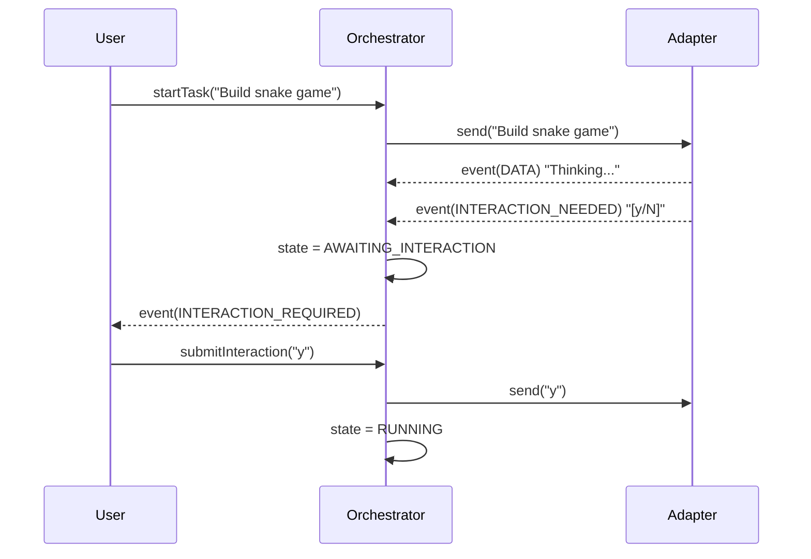

## Context
The Orchestrator is the "Manager". It needs to be lightweight but robust enough to handle the asynchronous nature of CLI tools.

## Design Decisions

### 1. Zero-Dependency State Machine
We will NOT use XState.
```typescript
enum AgentState {
  IDLE = 'IDLE',
  RUNNING = 'RUNNING',
  AWAITING_INTERACTION = 'AWAITING_INTERACTION',
  ERROR = 'ERROR'
}
```
The state is just a property on the class. Transitions are method calls.

### 2. Event-Driven Architecture


### 3. Session Isolation
The `WorkflowSession` object ensures that if we restart the CLI, we don't lose the high-level goal or the history of what we've done (in memory for now, persistable to JSON later).
