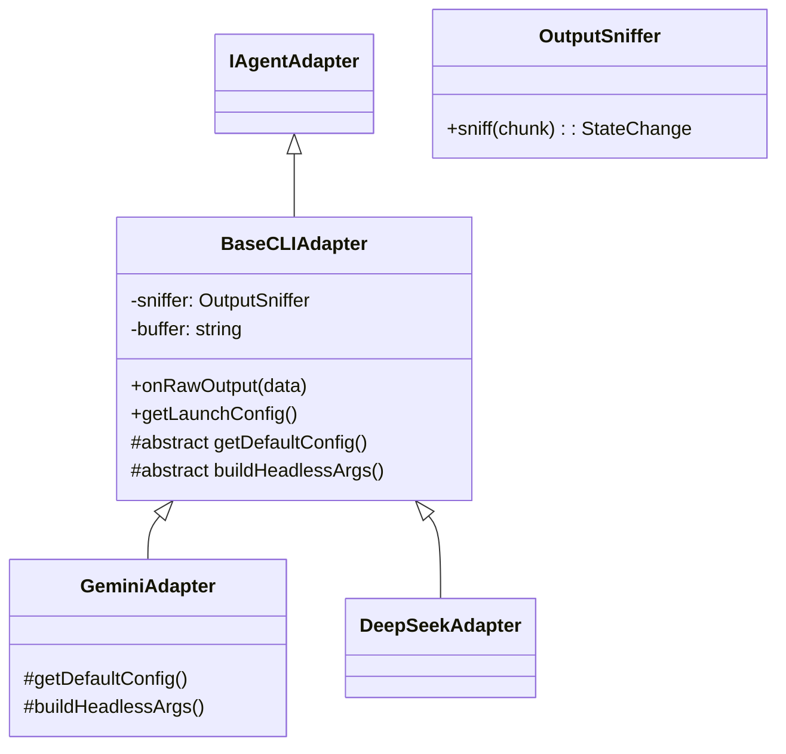

# Design: Adapter Architecture Refactoring

## Context
Currently, `GeminiAdapter` implements `IAgentAdapter` directly and manually handles:
1. Stream buffering (accumulating chunks).
2. Pattern matching (`sniff` logic).
3. Event emitting.
4. Process configuration.

This sets a bad precedent for future adapters.

## Goals
- **Minimize Boilerplate**: Adding a new adapter should require < 50 lines of code.
- **Separation of Concerns**: Logic for "How to talk to a process" (Base) vs "What process to talk to" (Implementation).
- **Testability**: `OutputSniffer` should be testable without spawning processes.

## Architecture

### Class Hierarchy



### Directory Structure

```text
src/
└── adapters/
    ├── base/
    │   ├── BaseCLIAdapter.ts   # Core logic
    │   └── OutputSniffer.ts    # Regex engine
    ├── gemini/
    │   ├── index.ts            # The thin adapter
    │   ├── args.ts             # Argument builders
    │   ├── patterns.json       # Config
    │   └── patterns.ts         # Loader
    └── IAgentAdapter.ts        # Interface
```

## Migration Plan
1. Create `src/adapters/base` and implementation files.
2. Refactor `GeminiAdapter` to move generic code to `BaseCLIAdapter`.
3. Move `GeminiAdapter` to `src/adapters/gemini/index.ts`.
4. Update consumers in `src/orchestrator` and `test/`.
